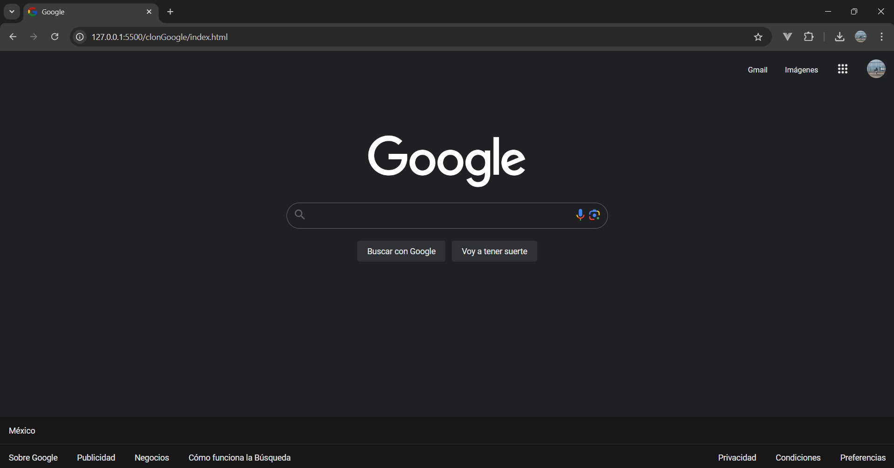

## Clon de la página principal de Google

### Descripción
Este proyecto es una recreación de la página principal de Google, desarrollada como parte del curso **Frontend by TecnoLochicas Pro 2024 - 2** de Santander. Utilizando únicamente HTML y CSS, se ha replicado la interfaz de usuario de uno de los sitios web más visitados del mundo.

### Tecnologías utilizadas
* **HTML5:** Estructura del contenido.
* **CSS3:** Estilos y diseño.

### Estructura del proyecto
* **index.html:** Código HTML principal.
* **style.css:** Hoja de estilos CSS.

### Clon de Google

   
